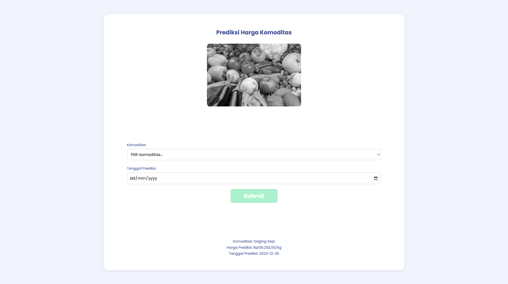

# SIL-datsci



## Set up & Installation

### 1. Create virtual environment

```sh
python3 -m venv venv
```

### 2. Activate the environment

```sh
// Windows
venv\Scripts\activate

// MacOS/Linux
source venv/bin/activate
```

### 3. Install requirements

```sh
pip install -r requirements.txt
```

### 4. Run project

```sh
python3 app.py
```


## Set up & Installation with Docker

### Run using docker-compose

```sh
// running docker
docker-compose up -d

// checking running docker
docker ps

// checking docker value
docker volume ls

// stop docker
docker-compose stop

// destroy docker
docker-compose down
```
